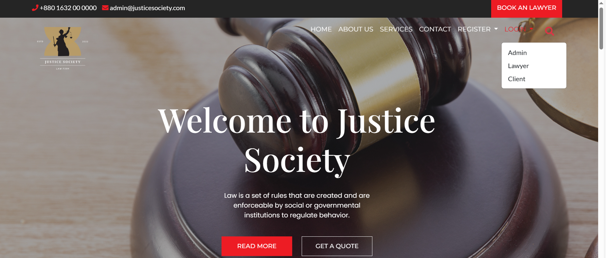
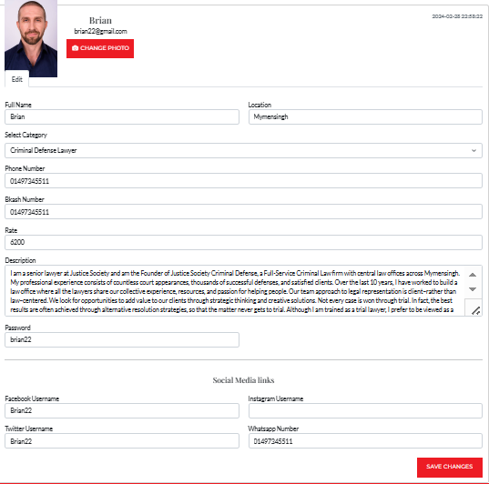
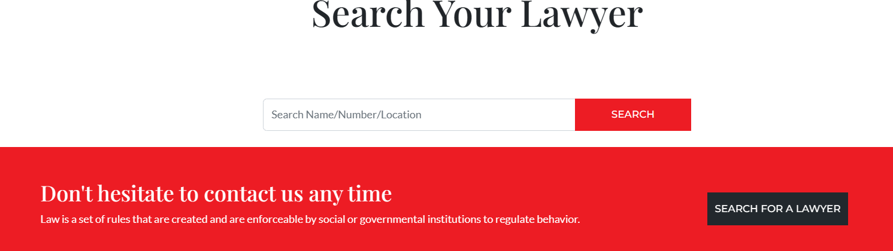
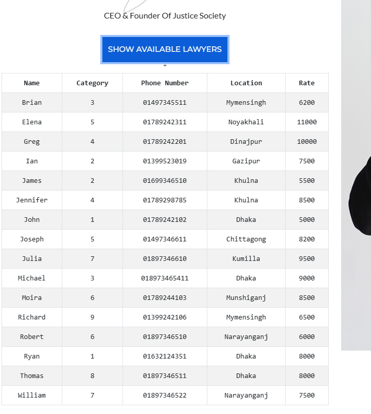
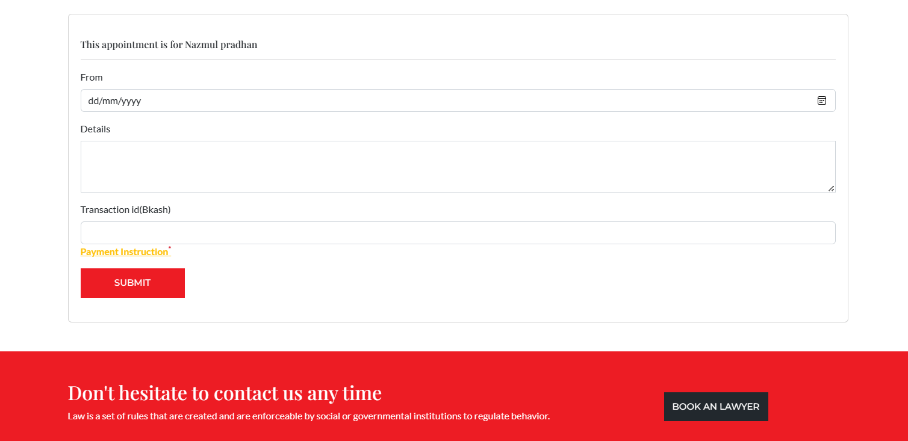
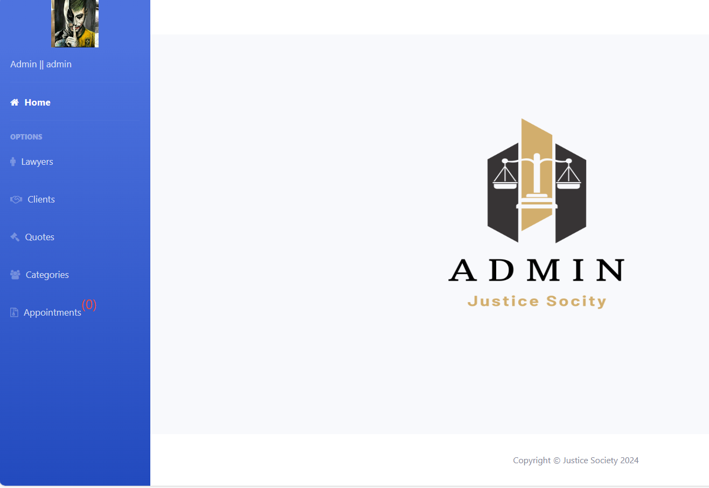

# Welcome to Justice Society

## Project Overview
* Justice Society is a user-friendly platform designed to effortlessly connect users with lawyers, providing a seamless experience to access a wide range of legal services without any inconvenience. The project includes several features such as User registration and login, Lawyer profile creation and management ,Search functionality for finding lawyers by name,
Appointment scheduling , Admin dashboard for managing users and lawyers.    
The project is built using HTML, CSS, JavaScript for the frontend, and PHP, MySQL for the backend. It offers a user-friendly interface that allows to Client and Lawyer easily navigate the website and access the available features.

## Motivation 
* The motivation behind Justice Society stems from the need to bridge the gap between clients seeking legal assistance and qualified legal experts. In today's complex legal landscape, individuals often struggle to find the right lawyer for their specific needs. Justice Society aims to streamline this process by providing a platform where clients can easily connect with experienced lawyers, ensuring access to justice for all.

For explore our project [website](http://localhost/firm/index.php)

## Project Features
* User registration and login: Allow users to create accounts and log in securely, providing
access to the platform's features and services.

* Lawyer profile creation and management: Lawyers can create and manage profiles
showcasing their expertise, contact information, and availability for client interaction.

* Search functionality for finding lawyers by name (Using API).

* Explore Legal Practice Area (Using API).

* Show all lawyer with detail information (Using API).

* Appointment scheduling. 

* Admin dashboard for managing users and lawyers: Administrators have access
to a centralized dashboard for overseeing user accounts, lawyer profiles, and addressing any
disputes or issues that arise within the platform.

 

## Future Plan
* Integration with legal document generation tools
* AI-powered legal assistance and chatbots
* Expansion to include additional legal services beyond    consultations

## Conclusion

* The Justice Society project is a valuable resource for Client and Lawyer, providing them
with a platform to connect with each other, access various opportunities. The project's
user-friendly interface, comprehensive features, and robust security measures make it a
top choice for Client and Lawyer to enhance their professional development. It is
designed to be secure, scalable, maintainable, and user-friendly, ensuring a smooth and
seamless user experience.

   
